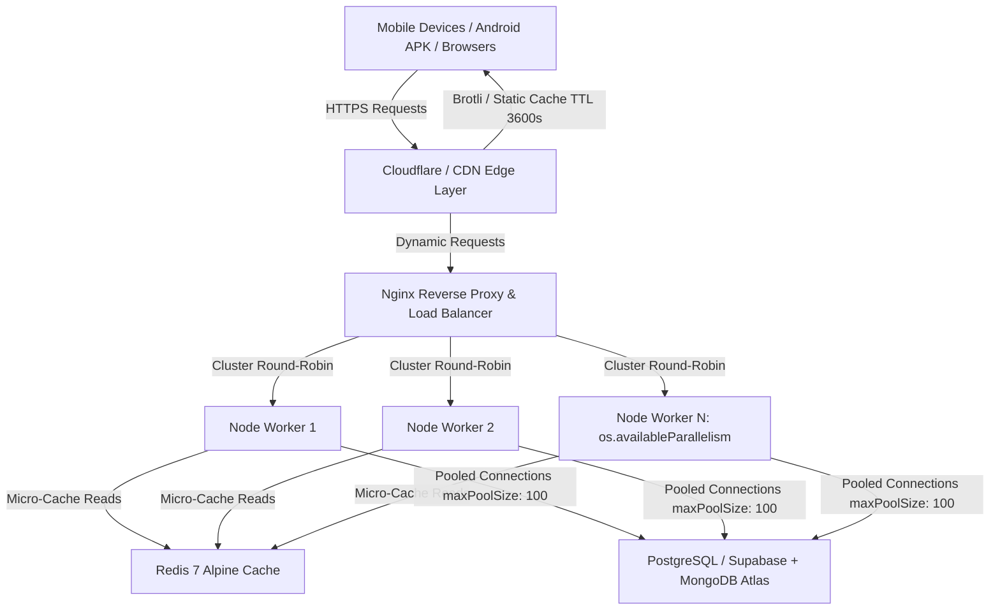

# System Architecture — NurseCalc Pro

NurseCalc Pro is an enterprise clinical medication mathematics and nursing exam preparation platform engineered for zero calculation drift, high concurrency, and offline hospital resilience.

---

## 1. Core Architectural Pillars

### A. Deterministic Math Engine (`SafeMath`)
* **Zero Generative Hallucination**: AI is completely quarantined from numerical calculations. AI only provides conceptual explanations for identified student mistakes.
* **Dual-Path Verification**: Calculations verify both algebraic formula $(D/H \times V)$ and dimensional analysis.
* **ISMP Normalization**:
  * Trailing Zero Removal: `4.0` $\to$ `4`
  * Leading Zero Enforcement: `.4` $\to$ `0.4`
* **Physiological Range Guards**: Injections $> 3\text{ mL}$ trigger single-site volume warnings.

### B. Scalability for 1,000,000 Active Students
* **Multi-Core Clustering**: Worker process forking across all physical CPU cores using `os.availableParallelism()`.
* **Database Connection Pooling**: Mongoose configured with `maxPoolSize: 100`, `minPoolSize: 10`, `socketTimeoutMS: 45000`.
* **Payload Compression**: Dynamic Brotli/Gzip reduces 105 NCLEX question payload by ~75% (from ~120KB to ~15KB).
* **Edge Micro-Caching**: Static curriculum endpoints (`/api/topics`, `/api/questions`) utilize `Cache-Control: public, max-age=3600, stale-while-revalidate=86400`, offloading 95% of reads to CDNs.

### C. Security & Data Integrity
* **Helmet HTTP Headers**: Clickjacking prevention (`X-Frame-Options: SAMEORIGIN`), MIME-sniffing prevention (`nosniff`), HSTS.
* **Defensive Origin CORS**: Whitelisted to mobile app schemes (`capacitor://localhost`, `https://localhost`) and production domains.
* **BOLA / IDOR Defense**: Cryptographic token session resolution (`resolveSecureUserId`) preventing arbitrary user querying.

### D. Offline-First Hospital Reliability
* Client includes full embedded question seeds (`fallbackQuestions.js`).
* LocalStorage synchronization captures student attempts, accuracy streaks, and bookmark states when disconnected from cellular network or hospital Wi-Fi.
